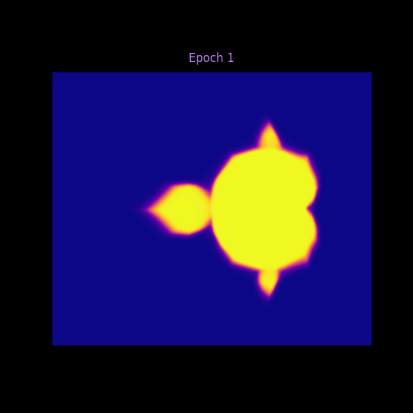
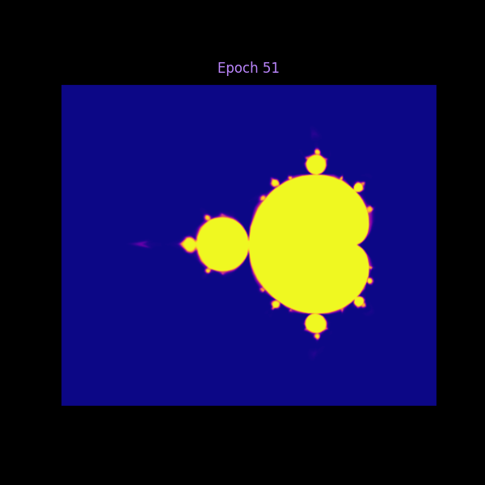
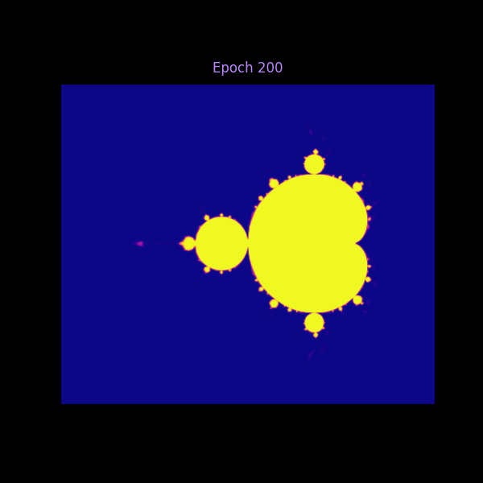

# 🌀 Mandelbrot Fractal Classifier

Welcome to the **Mandelbrot Fractal Classifier**! This project uses a **deep neural network** to classify points in 2D space as part of the **Mandelbrot set** or not. The model takes 2D coordinates as input and predicts whether each point belongs to the fractal. With multiple hidden layers and **ReLU activations**, the network gradually learns the intricate fractal boundary.  

✨ The training process is visualized **epoch by epoch**, creating images that can be combined into a **GIF** to watch the model learn the Mandelbrot fractal in real-time! 🌟

## 🎯 What is the Mandelbrot Set?

The **Mandelbrot set** is one of the most famous fractals in mathematics. It consists of all complex numbers \( c \) for which the function \( f_c(z) = z^2 + c \) does not diverge when iterated from \( z = 0 \). 

### 🔍 Real Mandelbrot Fractal
Here's what the actual Mandelbrot set looks like:


*The characteristic "cardioid" shape with self-similar patterns at all scales*

The black regions represent points that **belong** to the Mandelbrot set, while the colored regions show how quickly points outside the set diverge to infinity.

## 📊 Dataset

This repository does **not** include a pre-generated dataset (`dataset.csv`). Instead, a **script** is provided to generate the training data. The script samples 2D points in the complex plane 🌐 and labels them based on whether they belong to the Mandelbrot set (escape value = 1000) or not.  

This approach allows you to generate datasets of **any size** for training or experimentation, making the project fully **reproducible** and flexible. 🔄

## 🏗️ Model Architecture & Training

The model is a **deep feedforward neural network** built using TensorFlow/Keras. 🧠 It consists of:

- An **input layer** for 2D coordinates (x, y) 🎯
- **Multiple hidden layers** with 200 neurons each and **ReLU activation** 🔥
- An **output layer** with **sigmoid activation** to classify points as Mandelbrot (1) or not (0) 🎛️

```python
model = Sequential([
    Input(shape=(2,)),
    Dense(200, activation="relu"),
    Dense(200, activation="relu"),
    # ... multiple hidden layers
    Dense(1, activation="sigmoid")
])
```
# 🎥 Sample Epochs

Here’s how the model predictions evolve over training:

<p float="left">
  
  
  
</p>

# 🎥 Visualization & GIF

To make learning more **interactive** and **fun**, the training process generates images of the predicted Mandelbrot set at the end of each epoch. 🖼️ These images are saved in the `images/` folder. After training, you can combine them into a **GIF** to watch the model gradually learn the fractal pattern.✨  


# 🚀 How to Run & Usage

1. **Clone the repository** 📂

```bash
git clone https://github.com/yourusername/mandelbrot-classifier.git
cd mandelbrot-classifier
```
# 🧩 Dependencies & Requirements

Make sure you have the following installed before running the project:

- **Python 3.8+** 🐍  
- **TensorFlow** (`tensorflow>=2.0`) ⚡  
- **Pandas** (`pandas>=1.0`) 📊  
- **NumPy** (`numpy>=1.18`) 🔢  
- **Matplotlib** (`matplotlib>=3.0`) 📉
- 
## 😲End of Line

And that’s how our neural network learns the Mandelbrot set! Even Chester is surprised by how fast it picks up those intricate fractal patterns.  


> “Whoa… did it really learn that in 200 epochs?” 😆


